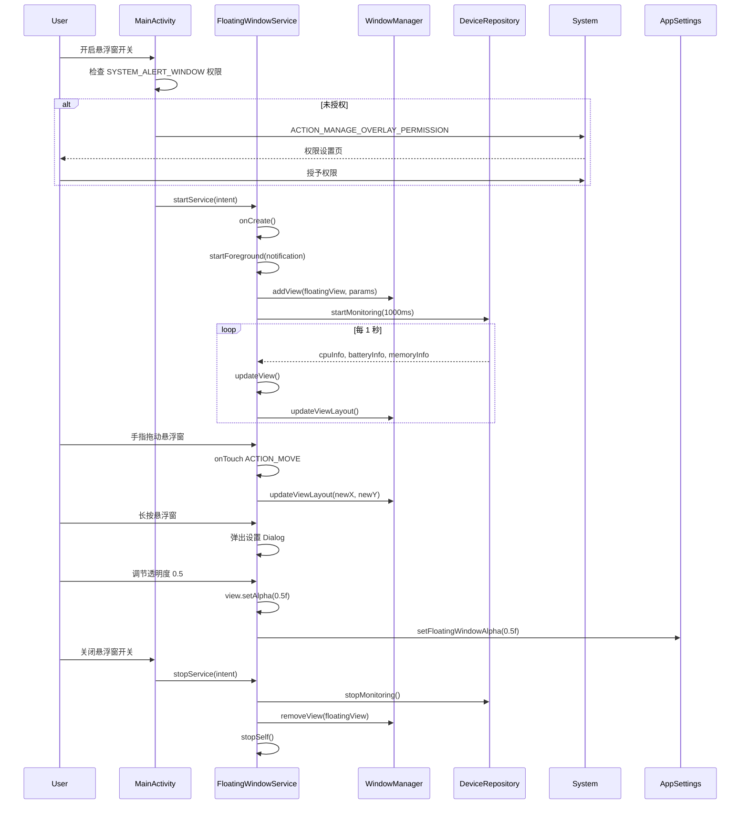
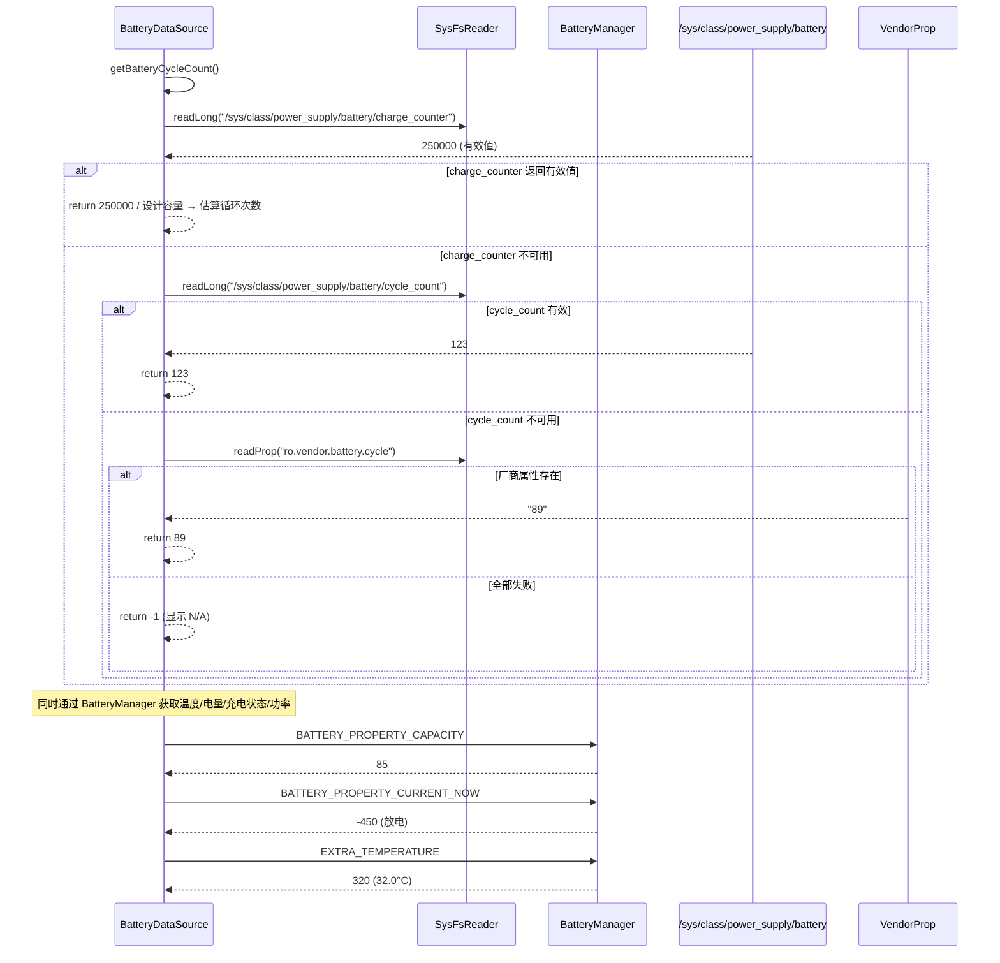
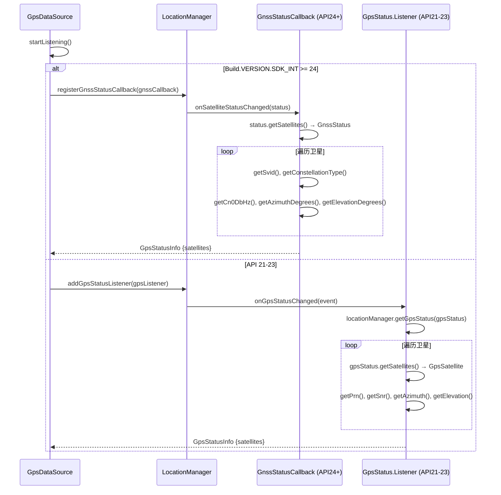
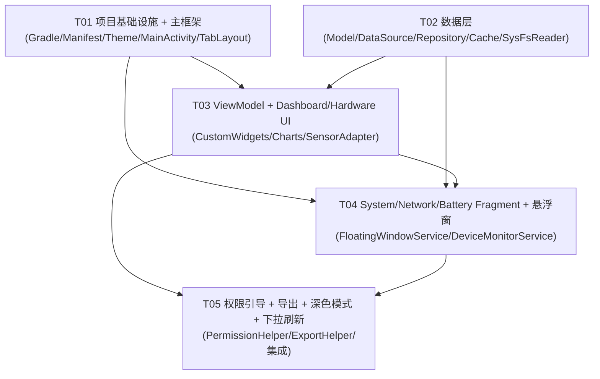

# Device Info Viewer — 系统架构设计

> **架构师**: Bob | **项目**: device_info_viewer  
> **技术栈**: Java + Android SDK, Material Design 3, minAPI 21, targetAPI 36  
> **架构模式**: MVVM (ViewModel + LiveData + Repository)

---

## Part A: 系统设计

### 1. 实现方案

#### 1.1 核心技术挑战

| 挑战 | 描述 | 应对策略 |
|------|------|----------|
| **多源数据采集** | 数据来自 `/proc`、`/sys`、Android API、BatteryManager、GnssStatus 等 10+ 种源 | 统一 DataSource 抽象层，每个数据源独立类，Repository 聚合 |
| **实时刷新性能** | 悬浮窗 1 秒刷新 + 主界面 2 秒刷新，高频读取 `/sys` 可能造成 jank | ViewModel + LiveData 异步采集，`ScheduledExecutorService` 后台线程池 |
| **API 兼容性** | GPS API 在 24+ 用 GnssStatus，21-23 用 GpsStatus；部分 sysfs 路径因厂商而异 | 运行时 `Build.VERSION.SDK_INT` 分支；sysfs 遍历 + 多路径 fallback |
| **悬浮窗 Service 保活** | 悬浮窗需前台 Service 防杀，且需处理权限引导 | `FOREGROUND_SERVICE_TYPE_SPECIAL_USE`（API 34+）+ 前台通知 |
| **电池循环次数** | 非标准 API，不同厂商路径不同 | 多级 fallback：`charge_counter` → `cycle_count` → 厂商属性 → `N/A` |
| **ZRAM 遍历** | 需遍历 `/sys/block/zram*` | 通用文件扫描，匹配 `zram` 前缀 |

#### 1.2 框架与库选型

| 用途 | 选择 | 版本 | 理由 |
|------|------|------|------|
| **UI 框架** | Material Design 3 (Material Components) | `1.12.0` | 原生支持 MD3，与 TabLayout/ViewPager2 无缝集成 |
| **架构组件** | AndroidX ViewModel + LiveData | `2.7.0` | Google 官方推荐，生命周期感知，避免内存泄漏 |
| **图表库** | MPAndroidChart | `3.1.0` | Android 最成熟的图表库，折线图 + 条形图均支持 |
| **异步调度** | `ScheduledExecutorService` (JDK) | — | 零依赖，精确控制周期性任务，适合定时刷新 |
| **深色模式** | `AppCompatDelegate` + `-night` 资源 | — | 原生支持，跟随系统/手动切换 |
| **权限请求** | AndroidX Activity Result API | `1.2.0` | 替代 deprecated 的 `onRequestPermissionsResult` |
| **ViewPager2** | AndroidX ViewPager2 | `1.1.0` | TabLayout 联动，支持 FragmentStateAdapter |
| **数据导出** | `Intent.ACTION_SEND` + JSONObject | — | 零依赖，系统分享 |

#### 1.3 架构分层

```
┌─────────────────────────────────────────────────┐
│  View Layer (Fragment / CustomView / Service)    │
│  ┌───────────┐ ┌──────────┐ ┌────────────────┐  │
│  │ Fragments │ │ Widgets  │ │ FloatingWindow │  │
│  │ (5 Tabs)  │ │ (Charts) │ │   Service      │  │
│  └─────┬─────┘ └────┬─────┘ └───────┬────────┘  │
├────────┼─────────────┼───────────────┼───────────┤
│  ViewModel Layer (LiveData / State)              │
│  ┌─────────┐ ┌────────┐ ┌───────┐ ┌──────────┐  │
│  │Dashboard│ │Hardware│ │System │ │Network/Bat│  │
│  │ViewModel│ │ViewModel│ │VM     │ │ViewModel  │  │
│  └────┬────┘ └───┬────┘ └──┬────┘ └─────┬─────┘  │
├───────┼──────────┼─────────┼────────────┼────────┤
│  Repository Layer                                │
│  ┌──────────────────────────────────────────┐    │
│  │         DeviceRepository                 │    │
│  │  (聚合各 DataSource + HistoryCache)       │    │
│  └──────┬──────────┬──────────┬────────────┘    │
├─────────┼──────────┼──────────┼─────────────────┤
│  DataSource Layer                               │
│  ┌───┐ ┌───┐ ┌───┐ ┌───┐ ┌───┐ ┌───┐ ┌──────┐ │
│  │CPU│ │GPU│ │Bat│ │Mem│ │Sto│ │Net│ │Sensor│ │
│  └───┘ └───┘ └───┘ └───┘ └───┘ └───┘ └──────┘ │
│  ┌────┐ ┌─────┐ ┌──────┐ ┌──────────┐          │
│  │WiFi│ │Mobile│ │GPS   │ │SysFsRdr  │          │
│  └────┘ └─────┘ └──────┘ └──────────┘          │
├─────────────────────────────────────────────────┤
│  SysFsReader (通用 /proc + /sys 文件读取工具)     │
└─────────────────────────────────────────────────┘
```

---

### 2. 文件列表

```
app/
├── build.gradle
└── src/main/
    ├── AndroidManifest.xml
    ├── java/com/example/deviceinfoviewer/
    │   ├── DeviceApplication.java              # Application 初始化
    │   ├── MainActivity.java                   # 主 Activity（TabLayout + ViewPager2）
    │   │
    │   ├── data/
    │   │   ├── model/
    │   │   │   ├── CpuInfo.java                # CPU 数据模型
    │   │   │   ├── CpuCoreInfo.java            # 单核信息
    │   │   │   ├── GpuInfo.java                # GPU 数据模型
    │   │   │   ├── BatteryInfo.java            # 电池数据模型
    │   │   │   ├── MemoryInfo.java             # 内存/ZRAM 数据模型
    │   │   │   ├── StorageInfo.java            # 存储分区数据模型
    │   │   │   ├── NetworkInterfaceInfo.java   # 网络接口数据模型
    │   │   │   ├── WifiDetailInfo.java         # WiFi 详情数据模型
    │   │   │   ├── MobileNetworkInfo.java      # 移动网络数据模型
    │   │   │   ├── GpsSatelliteInfo.java       # GPS 卫星数据模型
    │   │   │   ├── GpsStatusInfo.java          # GPS 定位状态模型
    │   │   │   ├── SensorItemInfo.java         # 传感器数据模型
    │   │   │   ├── SystemInfo.java             # Build/内核/JVM 信息模型
    │   │   │   └── HistoryDataPoint.java       # 历史数据点（时间戳 + 值）
    │   │   │
    │   │   ├── source/
    │   │   │   ├── SysFsReader.java            # 通用 /proc + /sys 文件读取
    │   │   │   ├── CpuDataSource.java          # CPU 数据采集
    │   │   │   ├── GpuDataSource.java          # GPU 数据采集
    │   │   │   ├── BatteryDataSource.java      # 电池数据采集
    │   │   │   ├── MemoryDataSource.java       # 内存/ZRAM 数据采集
    │   │   │   ├── StorageDataSource.java      # 存储分区数据采集
    │   │   │   ├── WifiDataSource.java         # WiFi 数据采集
    │   │   │   ├── MobileNetworkDataSource.java# 移动网络数据采集
    │   │   │   ├── NetworkInterfaceDataSource.java # 网络接口采集
    │   │   │   ├── GpsDataSource.java          # GPS 卫星数据采集
    │   │   │   ├── SensorDataSource.java       # 传感器列表采集
    │   │   │   └── SystemDataSource.java       # 系统信息采集
    │   │   │
    │   │   └── repository/
    │   │       ├── DeviceRepository.java       # 数据仓库（聚合入口）
    │   │       └── HistoryCache.java           # 1 小时内存历史缓存
    │   │
    │   ├── viewmodel/
    │   │   ├── DashboardViewModel.java         # 仪表盘 VM
    │   │   ├── HardwareViewModel.java          # 硬件 Tab VM
    │   │   ├── SystemViewModel.java            # 系统 Tab VM
    │   │   ├── NetworkViewModel.java           # 网络 Tab VM
    │   │   └── BatteryViewModel.java           # 电池 Tab VM
    │   │
    │   ├── view/
    │   │   ├── adapter/
    │   │   │   ├── TabPagerAdapter.java        # ViewPager2 Fragment 适配器
    │   │   │   ├── SensorListAdapter.java      # 传感器列表 RecyclerView 适配器
    │   │   │   └── NetworkInterfaceAdapter.java# 网络接口列表适配器
    │   │   │
    │   │   ├── fragment/
    │   │   │   ├── DashboardFragment.java      # 仪表盘 Tab
    │   │   │   ├── HardwareFragment.java       # 硬件 Tab
    │   │   │   ├── SystemFragment.java         # 系统 Tab
    │   │   │   ├── NetworkFragment.java        # 网络 Tab
    │   │   │   └── BatteryFragment.java        # 电池 Tab
    │   │   │
    │   │   └── widget/
    │   │       ├── CpuBarChartView.java        # CPU 每核频率横向条形图
    │   │       └── HistoryChartView.java       # 历史折线图（封装 MPAndroidChart）
    │   │
    │   ├── service/
    │   │   ├── DeviceMonitorService.java       # 后台数据采集 Service（前台）
    │   │   └── FloatingWindowService.java      # 悬浮窗 Service
    │   │
    │   ├── util/
    │   │   ├── PermissionHelper.java           # 权限分步引导工具
    │   │   ├── FormatUtils.java                # 数据格式化工具
    │   │   └── ExportHelper.java               # 数据导出/分享工具
    │   │
    │   └── settings/
    │       └── AppSettings.java                # SharedPreferences 封装
    │
    └── res/
        ├── layout/
        │   ├── activity_main.xml               # 主 Activity 布局
        │   ├── fragment_dashboard.xml          # 仪表盘布局
        │   ├── fragment_hardware.xml           # 硬件布局
        │   ├── fragment_system.xml             # 系统布局
        │   ├── fragment_network.xml            # 网络布局
        │   ├── fragment_battery.xml            # 电池布局
        │   ├── item_sensor.xml                 # 传感器列表项
        │   ├── item_network_interface.xml      # 网络接口列表项
        │   ├── layout_floating_window.xml      # 悬浮窗布局
        │   └── dialog_settings.xml             # 设置对话框
        │
        ├── drawable/
        │   ├── ic_dashboard.xml
        │   ├── ic_hardware.xml
        │   ├── ic_system.xml
        │   ├── ic_network.xml
        │   ├── ic_battery.xml
        │   ├── ic_float_window.xml
        │   └── bg_floating_window.xml
        │
        ├── values/
        │   ├── strings.xml
        │   ├── colors.xml
        │   ├── themes.xml
        │   └── dimens.xml
        │
        ├── values-night/
        │   └── themes.xml
        │
        ├── menu/
        │   └── main_menu.xml
        │
        └── xml/
            └── (empty — 无特殊 XML 配置)
```

**总计：63 个文件**（35 Java + 28 Resource）

---

### 3. 数据结构和接口（类图）

```mermaid
classDiagram
    direction TB

    %% ── 数据模型 ──
    class CpuInfo {
        +String architecture
        +int coreCount
        +List~CpuCoreInfo~ cores
        +float temperatureCelsius
        +long timestamp
    }

    class CpuCoreInfo {
        +int coreIndex
        +long currentFreqKHz
        +long maxFreqKHz
        +long minFreqKHz
        +String governor
    }

    class GpuInfo {
        +String model
        +String vendor
        +long frequencyKHz
        +float temperatureCelsius
        +long timestamp
    }

    class BatteryInfo {
        +float temperatureCelsius
        +float powerMilliwatts
        +int cycleCount
        +int capacityNowMAh
        +int capacityDesignMAh
        +int levelPercent
        +String chargeStatus
        +String health
        +String technology
        +float voltage
        +long timestamp
    }

    class MemoryInfo {
        +long totalKB
        +long availableKB
        +long usedKB
        +long swapTotalKB
        +long swapUsedKB
        +long zramOriginalKB
        +long zramCompressedKB
        +float compressionRatio
        +long timestamp
    }

    class StorageInfo {
        +long internalTotalBytes
        +long internalUsedBytes
        +long internalAvailableBytes
        +List~PartitionInfo~ partitions
    }

    class PartitionInfo {
        +String mountPoint
        +long totalBytes
        +long usedBytes
        +long availableBytes
    }

    class NetworkInterfaceInfo {
        +String name
        +String ipAddress
        +String macAddress
        +int mtu
        +long rxBytes
        +long txBytes
    }

    class WifiDetailInfo {
        +String ssid
        +String bssid
        +int signalDbm
        +int linkSpeedMbps
        +String ipv4
        +String ipv6
        +String macAddress
        +String gateway
        +String dns
        +String subnetMask
    }

    class MobileNetworkInfo {
        +String networkType
        +String operatorName
        +String mccMnc
        +int signalStrengthDbm
        +boolean isRoaming
    }

    class GpsSatelliteInfo {
        +int prn
        +String constellation
        +float snr
        +float elevation
        +float azimuth
        +boolean usedInFix
    }

    class GpsStatusInfo {
        +boolean gpsEnabled
        +boolean fixAcquired
        +double latitude
        +double longitude
        +float accuracy
        +int satelliteCount
        +List~GpsSatelliteInfo~ satellites
    }

    class SensorItemInfo {
        +String name
        +int type
        +String vendor
        +float powerMa
        +float maxRange
        +float resolution
        +int minDelay
    }

    class SystemInfo {
        +Map~String,String~ buildFields
        +String androidVersion
        +String kernelVersion
        +String javaVmVersion
        +String javaRuntimeName
        +String bootloader
        +String securityPatch
    }

    class HistoryDataPoint {
        +long timestampMillis
        +float value
        +String seriesName
    }

    %% ── DataSource 层 ──
    class SysFsReader {
        <<utility>>
        +static String readLine(String path)
        +static List~String~ readLines(String path)
        +static long readLong(String path)
        +static float readFloat(String path)
        +static boolean fileExists(String path)
        +static List~String~ listDir(String path)
        +static String readProp(String key)
    }

    class CpuDataSource {
        -SysFsReader sysFsReader
        +CpuInfo getCpuInfo()
        +List~CpuCoreInfo~ getCoreFreqs()
        +float getCpuTemperature()
        -String findThermalZone()
    }

    class GpuDataSource {
        -SysFsReader sysFsReader
        +GpuInfo getGpuInfo()
        -String findGpuPath()
        -float findGpuThermalZone()
    }

    class BatteryDataSource {
        -Context context
        -SysFsReader sysFsReader
        +BatteryInfo getBatteryInfo()
        +int getBatteryCycleCount()
        -int tryChargeCounter()
        -int tryCycleCount()
        -int tryVendorProp()
    }

    class MemoryDataSource {
        -SysFsReader sysFsReader
        +MemoryInfo getMemoryInfo()
        -long[] parseMeminfo()
        -ZramStats getZramStats()
    }

    class StorageDataSource {
        +StorageInfo getStorageInfo()
        -List~PartitionInfo~ getPartitions()
    }

    class NetworkInterfaceDataSource {
        +List~NetworkInterfaceInfo~ getNetworkInterfaces()
    }

    class WifiDataSource {
        -Context context
        +WifiDetailInfo getWifiDetail()
    }

    class MobileNetworkDataSource {
        -Context context
        +MobileNetworkInfo getMobileNetworkInfo()
    }

    class GpsDataSource {
        -Context context
        +void startListening(GpsCallback callback)
        +void stopListening()
        +GpsStatusInfo getCurrentStatus()
    }

    class SensorDataSource {
        -Context context
        +List~SensorItemInfo~ getAllSensors()
    }

    class SystemDataSource {
        +SystemInfo getSystemInfo()
        -Map~String,String~ collectBuildFields()
    }

    %% ── Repository 层 ──
    class DeviceRepository {
        -CpuDataSource cpuSource
        -GpuDataSource gpuSource
        -BatteryDataSource batterySource
        -MemoryDataSource memorySource
        -StorageDataSource storageSource
        -WifiDataSource wifiSource
        -MobileNetworkDataSource mobileSource
        -NetworkInterfaceDataSource netIfSource
        -GpsDataSource gpsSource
        -SensorDataSource sensorSource
        -SystemDataSource systemSource
        -HistoryCache historyCache
        -ScheduledExecutorService scheduler
        +LiveData~CpuInfo~ getCpuLiveData()
        +LiveData~BatteryInfo~ getBatteryLiveData()
        +LiveData~MemoryInfo~ getMemoryLiveData()
        +LiveData~List~NetworkInterfaceInfo~~ getNetworkInterfacesLiveData()
        +LiveData~WifiDetailInfo~ getWifiLiveData()
        +LiveData~MobileNetworkInfo~ getMobileNetworkLiveData()
        +LiveData~GpsStatusInfo~ getGpsLiveData()
        +LiveData~List~SensorItemInfo~~ getSensorsLiveData()
        +LiveData~SystemInfo~ getSystemLiveData()
        +LiveData~StorageInfo~ getStorageLiveData()
        +LiveData~GpuInfo~ getGpuLiveData()
        +void startMonitoring(int intervalMs)
        +void stopMonitoring()
        +List~HistoryDataPoint~ getHistory(String series, long from, long to)
    }

    class HistoryCache {
        -Map~String,LinkedList~HistoryDataPoint~~ seriesMap
        -long maxAgeMillis
        +void addPoint(String series, float value)
        +List~HistoryDataPoint~ getSeries(String series, long from, long to)
        +List~String~ getAvailableSeries()
        +void pruneOldData()
    }

    %% ── ViewModel 层 ──
    class DashboardViewModel {
        -DeviceRepository repository
        +LiveData~CpuInfo~ cpuInfo
        +LiveData~BatteryInfo~ batteryInfo
        +LiveData~MemoryInfo~ memoryInfo
        +LiveData~StorageInfo~ storageInfo
        +void startRefresh(int intervalMs)
        +void stopRefresh()
    }

    class HardwareViewModel {
        -DeviceRepository repository
        +LiveData~CpuInfo~ cpuInfo
        +LiveData~GpuInfo~ gpuInfo
        +LiveData~List~SensorItemInfo~~ sensors
        +void startRefresh(int intervalMs)
        +void stopRefresh()
    }

    class SystemViewModel {
        -DeviceRepository repository
        +LiveData~SystemInfo~ systemInfo
        +LiveData~StorageInfo~ storageInfo
        +void loadOnce()
    }

    class NetworkViewModel {
        -DeviceRepository repository
        +LiveData~WifiDetailInfo~ wifiInfo
        +LiveData~MobileNetworkInfo~ mobileInfo
        +LiveData~List~NetworkInterfaceInfo~~ interfaces
        +LiveData~GpsStatusInfo~ gpsStatus
        +void startRefresh(int intervalMs)
        +void stopRefresh()
    }

    class BatteryViewModel {
        -DeviceRepository repository
        +LiveData~BatteryInfo~ batteryInfo
        +List~HistoryDataPoint~ tempHistory
        +List~HistoryDataPoint~ powerHistory
        +List~HistoryDataPoint~ levelHistory
        +void startRefresh(int intervalMs)
        +void stopRefresh()
    }

    %% ── View / Service 层 ──
    class MainActivity {
        -TabLayout tabLayout
        -ViewPager2 viewPager
        -TabPagerAdapter adapter
        -AppSettings settings
        +onCreate()
        +onOptionsItemSelected()
    }

    class TabPagerAdapter {
        -List~Fragment~ fragments
        -List~String~ titles
        +getItemCount()
        +createFragment(position)
    }

    class DashboardFragment {
        -DashboardViewModel viewModel
        -TextView cpuTemp, cpuFreq
        -TextView batteryLevel, batteryTemp
        -TextView ramUsage
        -TextView storageUsage
    }

    class HardwareFragment {
        -HardwareViewModel viewModel
        -CpuBarChartView cpuBars
        -RecyclerView sensorList
        -SensorListAdapter sensorAdapter
    }

    class SystemFragment {
        -SystemViewModel viewModel
        -RecyclerView buildParamsList
        -SearchView searchView
    }

    class NetworkFragment {
        -NetworkViewModel viewModel
        -RecyclerView netIfList
        -NetworkInterfaceAdapter netIfAdapter
    }

    class BatteryFragment {
        -BatteryViewModel viewModel
        -HistoryChartView tempChart
        -HistoryChartView powerChart
        -HistoryChartView levelChart
    }

    class CpuBarChartView {
        +void setCoreData(List~CpuCoreInfo~ cores)
        +void updateFreqs(List~CpuCoreInfo~ cores)
    }

    class HistoryChartView {
        -LineChart lineChart
        +void addDataPoint(float value, long timestamp)
        +void setData(List~HistoryDataPoint~ data)
        +void setYAxisLabel(String label)
        +void clear()
    }

    class SensorListAdapter {
        -List~SensorItemInfo~ items
    }

    class NetworkInterfaceAdapter {
        -List~NetworkInterfaceInfo~ items
    }

    class FloatingWindowService {
        -WindowManager windowManager
        -View floatingView
        -DeviceRepository repository
        -ScheduledExecutorService scheduler
        +onCreate()
        +onStartCommand()
        +onDestroy()
        -updateView()
        -setupDragListener()
    }

    class DeviceMonitorService {
        -DeviceRepository repository
        +onStartCommand()
        +onDestroy()
    }

    class AppSettings {
        -SharedPreferences prefs
        +int getRefreshIntervalMs()
        +boolean isFloatingWindowEnabled()
        +float getFloatingWindowAlpha()
        +boolean isDarkModeEnabled()
        +String getDarkModeMode()
    }

    class PermissionHelper {
        +static String[] getRequiredPermissions()
        +static boolean checkAllGranted(Context ctx)
        +static void requestPermissions(Activity act, int step)
    }

    class ExportHelper {
        +static String exportToText(DeviceRepository repo)
        +static String exportToJson(DeviceRepository repo)
        +static void shareReport(Context ctx, String content)
    }

    class FormatUtils {
        +static String formatFreq(long khz)
        +static String formatBytes(long bytes)
        +static String formatTempCelsius(float temp)
        +static String formatDbm(int dbm)
        +static String formatPercent(int pct)
    }

    %% ── 关系 ──
    DeviceRepository ..> CpuDataSource : uses
    DeviceRepository ..> GpuDataSource : uses
    DeviceRepository ..> BatteryDataSource : uses
    DeviceRepository ..> MemoryDataSource : uses
    DeviceRepository ..> StorageDataSource : uses
    DeviceRepository ..> WifiDataSource : uses
    DeviceRepository ..> MobileNetworkDataSource : uses
    DeviceRepository ..> NetworkInterfaceDataSource : uses
    DeviceRepository ..> GpsDataSource : uses
    DeviceRepository ..> SensorDataSource : uses
    DeviceRepository ..> SystemDataSource : uses
    DeviceRepository --> HistoryCache : owns

    CpuDataSource ..> SysFsReader : uses
    GpuDataSource ..> SysFsReader : uses
    BatteryDataSource ..> SysFsReader : uses
    MemoryDataSource ..> SysFsReader : uses

    DashboardViewModel --> DeviceRepository : observes
    HardwareViewModel --> DeviceRepository : observes
    SystemViewModel --> DeviceRepository : observes
    NetworkViewModel --> DeviceRepository : observes
    BatteryViewModel --> DeviceRepository : observes

    DashboardFragment --> DashboardViewModel : observes
    HardwareFragment --> HardwareViewModel : observes
    HardwareFragment --> CpuBarChartView : contains
    HardwareFragment --> SensorListAdapter : uses
    SystemFragment --> SystemViewModel : observes
    NetworkFragment --> NetworkViewModel : observes
    NetworkFragment --> NetworkInterfaceAdapter : uses
    BatteryFragment --> BatteryViewModel : observes
    BatteryFragment --> HistoryChartView : contains

    MainActivity --> TabPagerAdapter : owns
    TabPagerAdapter ..> DashboardFragment : creates
    TabPagerAdapter ..> HardwareFragment : creates
    TabPagerAdapter ..> SystemFragment : creates
    TabPagerAdapter ..> NetworkFragment : creates
    TabPagerAdapter ..> BatteryFragment : creates

    FloatingWindowService --> DeviceRepository : observes
    DeviceMonitorService --> DeviceRepository : owns

    CpuInfo *-- CpuCoreInfo : contains
    GpsStatusInfo *-- GpsSatelliteInfo : contains
    StorageInfo *-- PartitionInfo : contains

    MainActivity ..> AppSettings : uses
    MainActivity ..> PermissionHelper : uses
    MainActivity ..> ExportHelper : uses

    BatteryViewModel ..> HistoryDataPoint : uses
```



---

### 4. 程序调用流程（时序图）

#### 4.1 主界面启动 + 数据刷新流程

```mermaid
sequenceDiagram
    participant User
    participant MainActivity
    participant DashboardFragment
    participant DashboardViewModel
    participant DeviceRepository
    participant CpuDataSource
    participant SysFsReader
    participant /sys/fs as /sys/devices/system/cpu

    User->>MainActivity: 启动 App
    MainActivity->>MainActivity: onCreate()
    MainActivity->>MainActivity: 检查权限 → PermissionHelper.checkAllGranted()
    alt 权限未授权
        MainActivity->>User: 分步引导权限
    end
    MainActivity->>MainActivity: setupViewPager()
    MainActivity->>TabPagerAdapter: createFragment(0) → DashboardFragment

    DashboardFragment->>DashboardFragment: onCreateView()
    DashboardFragment->>DashboardViewModel: new ViewModelProvider().get()

    DashboardFragment->>DashboardFragment: onResume()
    DashboardFragment->>DashboardViewModel: startRefresh(2000ms)

    DashboardViewModel->>DeviceRepository: startMonitoring(2000ms)
    DeviceRepository->>DeviceRepository: scheduler.scheduleAtFixedRate(...)

    loop 每 2 秒
        DeviceRepository->>CpuDataSource: getCpuInfo()
        CpuDataSource->>SysFsReader: readLine("/sys/devices/system/cpu/cpu0/cpufreq/scaling_cur_freq")
        SysFsReader->>/sys/fs: cat 读取
        /sys/fs-->>SysFsReader: "1800000"
        SysFsReader-->>CpuDataSource: "1800000"

        CpuDataSource->>SysFsReader: 遍历 cpu0..cpuN
        CpuDataSource->>SysFsReader: findThermalZone()

        CpuDataSource-->>DeviceRepository: CpuInfo {cores, temp}

        DeviceRepository-->>DashboardViewModel: cpuLiveData.postValue(cpuInfo)
        DashboardViewModel-->>DashboardFragment: LiveData onChange
        DashboardFragment->>DashboardFragment: updateUI()
    end

    DashboardFragment->>DashboardFragment: onPause()
    DashboardFragment->>DashboardViewModel: stopRefresh()
    DashboardViewModel->>DeviceRepository: stopMonitoring()
```

#### 4.2 悬浮窗生命周期



#### 4.3 P0-3 电池数据采集流程（多路径 fallback）



#### 4.4 GPS 兼容采集（API 21-23 vs 24+）



---

### 5. 待明确事项

| # | 问题 | 当前假设 |
|---|------|----------|
| 1 | GPU 频率在部分设备上不可读（`/sys/class/kgsl/kgsl-3d0/gpuclk` 可能需要 root） | 尽力读取，失败显示 "N/A" |
| 2 | 电池功率计算：`current_now × voltage_now / 1000` | 使用此公式，`current_now` 可能为负值（放电） |
| 3 | "电话状态"权限（P2-5）具体用途 | 假设用于获取 MCC/MNC/网络类型 `TelephonyManager` |
| 4 | 悬浮窗"切换指标"功能具体交互 | 假设长按弹出设置 Dialog，可切换显示的指标组合 |
| 5 | 历史图表的 X 轴时间粒度 | 假设按刷新间隔采样（2 秒一个点），1 小时 = 最多 1800 点 |

---

## Part B: 任务分解

### 6. 依赖包列表

```
# app/build.gradle dependencies

// AndroidX Core
implementation 'androidx.core:core:1.13.1'
implementation 'androidx.appcompat:appcompat:1.7.0'
implementation 'androidx.constraintlayout:constraintlayout:2.1.4'

// Material Design 3
implementation 'com.google.android.material:material:1.12.0'

// Architecture Components
implementation 'androidx.lifecycle:lifecycle-viewmodel:2.8.0'
implementation 'androidx.lifecycle:lifecycle-livedata:2.8.0'
implementation 'androidx.lifecycle:lifecycle-runtime:2.8.0'

// ViewPager2
implementation 'androidx.viewpager2:viewpager2:1.1.0'

// RecyclerView (ViewPager2 已依赖，显式声明确保版本)
implementation 'androidx.recyclerview:recyclerview:1.3.2'

// Activity Result API (权限请求)
implementation 'androidx.activity:activity:1.9.0'

// MPAndroidChart (历史图表)
implementation 'com.github.PhilJay:MPAndroidChart:v3.1.0'

// Gson (数据导出 JSON)
implementation 'com.google.code.gson:gson:2.10.1'

// SwipeRefreshLayout
implementation 'androidx.swiperefreshlayout:swiperefreshlayout:1.1.0'
```

**根 build.gradle** 需添加：
```
maven { url 'https://jitpack.io' }  // for MPAndroidChart
```

---

### 7. 任务列表（5 个任务，按依赖顺序）

#### T01: 项目基础设施 + 主框架搭建

| 属性 | 内容 |
|------|------|
| **Task ID** | T01 |
| **优先级** | P0 |
| **依赖** | 无 |
| **Source Files** | `build.gradle`, `AndroidManifest.xml`, `DeviceApplication.java`, `MainActivity.java`, `activity_main.xml`, `TabPagerAdapter.java`, `AppSettings.java`, `FormatUtils.java`, `res/values/strings.xml`, `res/values/colors.xml`, `res/values/themes.xml`, `res/values-night/themes.xml`, `res/values/dimens.xml`, `res/drawable/ic_*.xml`, `res/menu/main_menu.xml` |

**工作内容**：
1. Gradle 配置：声明全部 dependencies + jitpack 仓库
2. AndroidManifest.xml：声明权限（`BATTERY_STATS`, `ACCESS_WIFI_STATE`, `ACCESS_FINE_LOCATION`, `SYSTEM_ALERT_WINDOW`, `READ_PHONE_STATE`, `FOREGROUND_SERVICE`, `FOREGROUND_SERVICE_SPECIAL_USE`）+ Service 注册
3. DeviceApplication.java：初始化全局 Context 引用
4. MainActivity.java：TabLayout + ViewPager2 骨架，绑定 TabPagerAdapter（先用占位 Fragment），Toolbar + menu
5. activity_main.xml：CoordinatorLayout → AppBarLayout + TabLayout + ViewPager2
6. TabPagerAdapter.java：管理 5 个 Fragment 实例，传递标题
7. AppSettings.java：SharedPreferences 封装（刷新间隔/悬浮窗开关/透明度/深色模式/悬浮窗位置）
8. FormatUtils.java：formatFreq / formatBytes / formatTempCelsius / formatDbm / formatPercent
9. res/values/themes.xml + values-night/themes.xml：Material 3 日间/夜间主题
10. 5 个 Tab 图标 drawable

**产出**：可编译运行、显示 5 个空白 Tab 的 App 骨架

---

#### T02: 数据层（模型 + DataSource + Repository + 缓存）

| 属性 | 内容 |
|------|------|
| **Task ID** | T02 |
| **优先级** | P0 |
| **依赖** | 无（可独立于 T01 编写，但依赖 T01 的 Gradle 配置才能编译） |
| **Source Files** | 全部 `data/model/*.java`（12个）, 全部 `data/source/*.java`（12个）, `data/repository/DeviceRepository.java`, `data/repository/HistoryCache.java`, `SysFsReader.java` |

**工作内容**：
1. SysFsReader.java：静态工具类，封装 `readLine(path)`, `readLong(path)`, `readFloat(path)`, `fileExists(path)`, `listDir(path)`, `readProp(key)` 全部带 try-catch，返回 safe default
2. 全部 Model 类（12个）：纯数据类，含所有字段 + getter + toString
3. 全部 DataSource 类（12个）：
   - CpuDataSource：解析 `/sys/devices/system/cpu/cpu*/cpufreq/`，多路径扫描温度
   - GpuDataSource：扫描 `/sys/class/kgsl/` + thermal zone
   - BatteryDataSource：BatteryManager + sysfs，多路径循环次数
   - MemoryDataSource：`/proc/meminfo` + ZRAM 遍历
   - StorageDataSource：StatFs + `/proc/partitions`
   - WifiDataSource：WifiManager API
   - MobileNetworkDataSource：TelephonyManager
   - NetworkInterfaceDataSource：NetworkInterface API
   - GpsDataSource：双路径 GPS（API 21-23 + 24+）
   - SensorDataSource：SensorManager
   - SystemDataSource：Build.* + SystemProperties
4. HistoryCache.java：`ConcurrentHashMap<String, LinkedList<HistoryDataPoint>>`，ScheduledExecutorService 每 60 秒 prune，最大保留 1 小时
5. DeviceRepository.java：聚合所有 DataSource，提供 `LiveData<T>` 出口，`ScheduledExecutorService` 驱动定时刷新

---

#### T03: ViewModel 层 + Dashboard/Hardware Fragment UI

| 属性 | 内容 |
|------|------|
| **Task ID** | T03 |
| **优先级** | P0（Dashboard 聚合展示是 P0-7 核心） |
| **依赖** | T01、T02 |
| **Source Files** | `viewmodel/DashboardViewModel.java`, `viewmodel/HardwareViewModel.java`, `fragment/DashboardFragment.java`, `fragment/HardwareFragment.java`, `widget/CpuBarChartView.java`, `widget/HistoryChartView.java`, `adapter/SensorListAdapter.java`, `layout/fragment_dashboard.xml`, `layout/fragment_hardware.xml`, `layout/item_sensor.xml` |

**工作内容**：
1. DashboardViewModel.java：聚合 cpu/battery/memory/storage 四个 LiveData，`startRefresh(intervalMs)` / `stopRefresh()`
2. HardwareViewModel.java：聚合 cpu/gpu/sensors LiveData
3. DashboardFragment.java：卡片网格布局（CardView），CPU 温度/频率概览 + 电池电量/温度 + RAM 占用% + 存储使用%
4. HardwareFragment.java：CPU 每核条形图 + GPU 信息卡片 + RecyclerView 传感器列表
5. CpuBarChartView.java：自定义 View，Canvas 绘制横向条形图，每核一条，颜色渐变（绿→黄→红）
6. HistoryChartView.java：封装 MPAndroidChart LineChart，提供 `addDataPoint()` / `setData()` / `clear()`，支持多系列
7. SensorListAdapter.java：RecyclerView.Adapter
8. 对应 layout XML 文件

---

#### T04: System / Network / Battery Fragment + 悬浮窗 + 后台 Service

| 属性 | 内容 |
|------|------|
| **Task ID** | T04 |
| **优先级** | P1 |
| **依赖** | T01、T02、T03（T03 中 HistoryChartView 供 BatteryFragment 使用） |
| **Source Files** | `viewmodel/SystemViewModel.java`, `viewmodel/NetworkViewModel.java`, `viewmodel/BatteryViewModel.java`, `fragment/SystemFragment.java`, `fragment/NetworkFragment.java`, `fragment/BatteryFragment.java`, `adapter/NetworkInterfaceAdapter.java`, `service/DeviceMonitorService.java`, `service/FloatingWindowService.java`, `layout/fragment_system.xml`, `layout/fragment_network.xml`, `layout/fragment_battery.xml`, `layout/item_network_interface.xml`, `layout/layout_floating_window.xml`, `layout/dialog_settings.xml`, `drawable/bg_floating_window.xml`, `drawable/ic_float_window.xml` |

**工作内容**：
1. SystemViewModel.java：loadOnce() 拉取 SystemInfo + StorageInfo
2. NetworkViewModel.java：wifiInfo + mobileInfo + interfaces + gpsStatus
3. BatteryViewModel.java：batteryInfo + tempHistory + powerHistory + levelHistory
4. SystemFragment.java：Build 参数可搜索（SearchView 过滤）RecyclerView + 长按复制 + 存储分区信息
5. NetworkFragment.java：WiFi 卡片 + 移动网络卡片 + 网络接口 RecyclerView + GPS 状态卡片
6. BatteryFragment.java：充放电状态可视化 + 温度/功率/容量/循环次数 + 三个 HistoryChartView（温度/功率/电量）
7. NetworkInterfaceAdapter.java：RecyclerView.Adapter
8. DeviceMonitorService.java：前台 Service，持有 DeviceRepository，保持后台刷新
9. FloatingWindowService.java：前台 Service，WindowManager 添加悬浮窗 View，touch listener 拖拽 + 长按设置，实时更新
10. layout_floating_window.xml：半透明圆角卡片，4 行信息
11. 对应 layout XML 文件

---

#### T05: 权限引导 + 设置 + 导出 + 深色模式切换 + 下拉刷新 + 最终集成

| 属性 | 内容 |
|------|------|
| **Task ID** | T05 |
| **优先级** | P2 |
| **依赖** | T01、T03、T04 |
| **Source Files** | `util/PermissionHelper.java`, `util/ExportHelper.java`, 修改 `MainActivity.java`, 修改 `DeviceApplication.java`, 修改所有 5 个 `Fragment`（添加 SwipeRefreshLayout）, 修改 `AndroidManifest.xml`（如有遗漏权限）, `dialog_settings.xml`（如未完成） |

**工作内容**：
1. PermissionHelper.java：分步权限引导（Step1 定位 → Step2 悬浮窗 → Step3 电话状态），每步带解释 Dialog
2. ExportHelper.java：exportToText() / exportToJson() 遍历 DeviceRepository 所有数据，生成结构化报告，Intent.ACTION_SEND 分享
3. 深色模式：MainActivity toolbar 菜单切换（跟随系统 / 浅色 / 深色），AppCompatDelegate.setDefaultNightMode()
4. 下拉刷新：为 5 个 Fragment 添加 SwipeRefreshLayout 包裹，手动触发一次即时刷新
5. 设置 Dialog：刷新间隔（SeekBar 1-10秒）、悬浮窗透明度（SeekBar）、悬浮窗显示指标选择（CheckBox）
6. 最终集成：把所有 Fragment 替换进 TabPagerAdapter，端到端测试全流程

---

### 8. 共享知识（跨文件约定）

```
## 命名规范
- 包名：com.example.deviceinfoviewer（项目前期）；发布时改为正式包名
- 类名：PascalCase（CpuDataSource, DashboardViewModel）
- 方法名：camelCase（getCpuInfo, startMonitoring）
- 常量：UPPER_SNAKE_CASE（DEFAULT_INTERVAL_MS = 2000）
- 资源 ID：snake_case（fragment_dashboard, ic_battery）

## 权限申请模式
- 使用 Activity Result API（registerForActivityResult）而非 onRequestPermissionsResult
- PermissionHelper 统一管理权限列表和分步引导
- 每步权限请求前显示解释 Dialog（为什么需要此权限）

## SysFsReader 使用规范
- 所有 /proc /sys 读取必须经过 SysFsReader，不允许直接 File IO
- 返回值安全：readLong 失败返回 -1，readFloat 失败返回 Float.NaN，readLine 失败返回 ""
- 调用者判断返回值合法性后再使用

## 数据采集线程安全
- DeviceRepository 的 ScheduledExecutorService 在后台线程执行数据采集
- LiveData.postValue() 用于跨线程数据推送（内部切到主线程）
- HistoryCache 使用 ConcurrentHashMap 保证线程安全

## 单位约定
- 频率：内部用 KHz，显示时 FormatUtils.formatFreq() 自动转为 GHz/MHz
- 温度：内部用摄氏度 (°C) float，显示精度 0.1°C
- 内存/存储：内部用 byte，显示时 FormatUtils.formatBytes() 自动转为 GB/MB/KB
- 电池电量：0-100 整数百分比
- 信号强度：dBm 整数
- 时间戳：System.currentTimeMillis()（毫秒 UTC）

## LiveData 观察模式
- Fragment 在 onResume() 中 observe，onPause() 中 removeObserver
- 或使用 getViewLifecycleOwner() 自动绑定生命周期

## 悬浮窗窗口参数
- WindowManager.LayoutParams.TYPE_APPLICATION_OVERLAY（API 26+）/ TYPE_PHONE（API 21-25）
- FLAG_NOT_FOCUSABLE | FLAG_LAYOUT_NO_LIMITS
- Gravity.TOP | Gravity.START
- 初始位置：右上角（x=屏幕宽度-悬浮窗宽度-16dp, y=状态栏下方+16dp）

## 错误处理策略
- 数据不可获取时：显示 "N/A" 或 "—"，不崩溃
- sysfs 读取异常：SysFsReader 内部捕获，返回 safe default
- 权限未授予时：对应数据区域显示"需要权限"提示，并提供跳转入口
```

---

### 9. 任务依赖图



---

> **文档版本**: v1.0 | **日期**: 2026-05-20 | **架构师**: Bob
